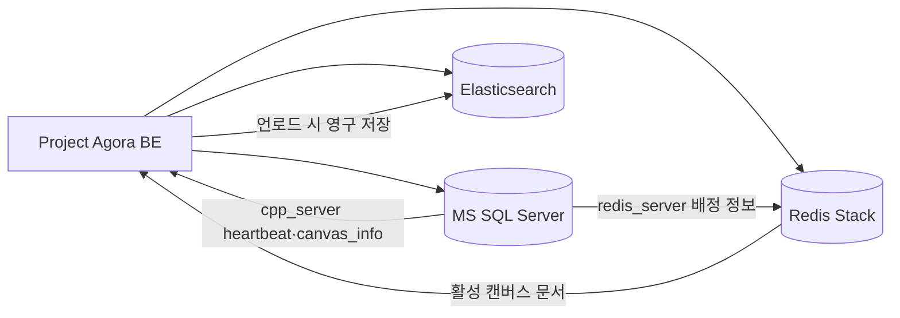

# Project Agora DB

Project Agora의 저장소 인프라입니다. Docker Compose로 MS SQL Server, Redis Stack, Elasticsearch를 실행하고 애플리케이션 계정, 스키마, RedisJSON/RediSearch, Elasticsearch 인덱스를 초기화합니다.

애플리케이션 및 실시간 서버는 [Project Agora BE](../project-agora-BE)에서 실행합니다.

## 구성

| 저장소 | 역할 | 컨테이너 | 기본 로컬 포트 |
| --- | --- | --- | --- |
| MS SQL Server 2022 | 사용자, 세션, 캔버스 배정, C++·Redis 서버 메타데이터 | `agora-mssql` | `1433` |
| Redis Stack | 활성 캔버스 RedisJSON, RediSearch | `agora-redis-stack` | `6379` |
| Redis Insight | Redis 관리 UI | `agora-redis-stack` | `8001` |
| Elasticsearch 8.15 | 캔버스 문서 영구 저장과 검색 | `agora-elasticsearch` | `9200` |

세 서비스는 Compose 네트워크 `agora-net`을 공유합니다. 기본값은 호스트의 loopback에만 DB, Redis, Elasticsearch를 바인딩합니다.



## 빠른 시작

### 1. 환경 파일 준비

각 서비스는 독립 환경 파일을 사용합니다. 예시 파일을 복사한 뒤 모든 `change-me` 값을 충분히 긴 난수로 교체합니다.

```bash
cd /path/to/project-agora-DB
cp mssql/.env.example mssql/.env
cp redis/.env.example redis/.env
cp elasticsearch/.env.example elasticsearch/.env
chmod 600 mssql/.env redis/.env elasticsearch/.env
```

| 파일 | 필수 비밀값 |
| --- | --- |
| `mssql/.env` | `MSSQL_SA_PASSWORD`, `MSSQL_PASSWORD` |
| `redis/.env` | `REDIS_PASSWORD`, `REDIS_USER_PASSWORD` |
| `elasticsearch/.env` | `ELASTIC_PASSWORD`, `ES_USER_PASSWORD` |

비밀번호는 Git에 추가하지 않습니다. BE의 `DB_PASSWORD`, `REDIS_USER_PASSWORD`, `ES_USER_PASSWORD`는 이 저장소의 애플리케이션 사용자 비밀번호와 일치해야 합니다.

### 2. 컨테이너 실행

```bash
docker compose up -d
docker compose ps
```

`mssql-init`은 MS SQL health check 이후 스키마를 적용하는 일회성 컨테이너입니다. 상태와 로그를 확인합니다.

```bash
docker compose logs mssql-init
docker compose ps
```

### 3. 초기화 재실행 또는 개별 초기화

초기화 스크립트는 반복 실행할 수 있도록 작성되었습니다. 마이그레이션을 다시 적용하거나 컨테이너 밖에서 초기화할 때 사용합니다.

```bash
./mssql/init-mssql.sh
./redis/init-redis.sh
./elasticsearch/init-elasticsearch.sh
```

초기화 후 BE 실행 방법은 [Project Agora BE README](../project-agora-BE/README.md)를 참고하세요.

## 환경 변수

### MS SQL Server — `mssql/.env`

| 변수 | 설명 |
| --- | --- |
| `MSSQL_SA_PASSWORD` | SQL Server 관리자 비밀번호 |
| `MSSQL_PID` | 라이선스 에디션. 기본 `Express` |
| `TIMEZONE` | 컨테이너 시간대 |
| `MSSQL_DB` | 데이터베이스 이름, 기본 `agora_db` |
| `MSSQL_USER`, `MSSQL_PASSWORD` | BE·C++가 사용하는 애플리케이션 계정 |
| `MSSQL_PORT`, `MSSQL_EXTERNAL_IP`, `MSSQL_EXTERNAL_PORT` | 내부 포트와 호스트 포트 바인딩 |
| `MSSQL_TABLE_USERS`, `MSSQL_TABLE_REDIS_SERVER` | 사용자·Redis 서버 테이블 이름 |
| `MSSQL_TABLE_CANVAS_INFO`, `MSSQL_TABLE_CPP_SERVER` | 캔버스·C++ 서버 테이블 이름 |

### Redis Stack — `redis/.env`

| 변수 | 설명 |
| --- | --- |
| `REDIS_PASSWORD` | Redis 기본 사용자 비밀번호 및 health check 용도 |
| `REDIS_USER`, `REDIS_USER_PASSWORD` | `canvas:*` 범위로 제한된 애플리케이션 ACL 계정 |
| `TIMEZONE` | 컨테이너 시간대 |
| `REDIS_INDEX_NAME` | 기본 `idx:canvas` |
| `REDIS_KEY_PREFIX` | 기본 `canvas:` |
| `REDIS_PORT`, `REDIS_BIND_IP`, `REDIS_EXTERNAL_IP`, `REDIS_EXTERNAL_PORT` | Redis 포트와 호스트 바인딩·등록 주소 |
| `REDIS_INSIGHT_PORT` | Redis Insight 포트 |

### Elasticsearch — `elasticsearch/.env`

| 변수 | 설명 |
| --- | --- |
| `ELASTIC_PASSWORD` | `elastic` 관리자 비밀번호 |
| `TIMEZONE` | 컨테이너 시간대 |
| `ES_INDEX` | 캔버스 인덱스, 기본 `canvas` |
| `ES_USER_NAME`, `ES_USER_PASSWORD` | BE·C++가 사용하는 애플리케이션 사용자 |
| `ES_EXTERNAL_IP`, `ES_EXTERNAL_PORT` | 호스트 포트 바인딩 |
| `ES_JAVA_MIN_MEM`, `ES_JAVA_MAX_MEM` | Elasticsearch JVM 메모리 |

## 데이터 모델과 수명 주기

MS SQL은 관계형 메타데이터와 현재 배정 상태를 보관합니다.

| 테이블 | 용도 |
| --- | --- |
| `users` | 이메일, BCrypt 비밀번호 해시, 닉네임·태그, 역할, 상태 |
| `user_sessions` | 사용자별 현재 접속 여부, 캔버스, C++ 서버 참조 |
| `redis_server` | 사용 가능한 Redis 인스턴스 |
| `cpp_server` | C++ REST/WS 포트, 활성 여부, `last_heartbeat_at` |
| `canvas_info` | Redis·C++ 서버 배정 및 `is_cached` 상태 |

캔버스 본문은 Elasticsearch에 영구 저장하고, 접속 중에는 RedisJSON의 `canvas:{canvasId}` 키에 둡니다. C++ 서버가 마지막 접속자를 확인하면 RedisJSON 문서를 Elasticsearch로 저장하고 Redis 키 및 `canvas_info` 배정을 해제합니다.

`cpp_server`의 식별자는 `(server_ip, server_port)`입니다. C++ 서버가 5초마다 heartbeat를 갱신하며 BE는 최신 heartbeat와 health check를 모두 만족한 서버만 할당합니다.

## 운영 명령

```bash
# 전체 상태와 로그
docker compose ps
docker compose logs -f mssql redis-stack elasticsearch

# 컨테이너 중지·재시작 — 데이터 볼륨 유지
docker compose stop
docker compose start

# Compose 설정 검증
docker compose config -q
```

데이터 볼륨을 포함한 완전 초기화는 되돌릴 수 없습니다. 일반적인 개발 데이터 정리는 아래 스크립트를 먼저 사용하세요.

```bash
# 확인 후 전체 테스트 데이터 정리
./clean-storages.sh

# 확인 없이 실행 — 현재 데이터에 영향을 주므로 주의
./clean-storages.sh -y

# 저장소별 정리
./mssql/clean-mssql.sh -y
./redis/clean-redis.sh -y
./elasticsearch/clean-elasticsearch.sh -y
```

## 점검과 검색

```bash
# 세 저장소의 애플리케이션 계정, CRUD, 권한 검증
python3 tests/test_storages.py

# 전체 저장소 조회 또는 키워드 검색
./search-storages.sh
./search-storages.sh -q "keyword"

# 저장소별 조회
./mssql/search-mssql.sh
./redis/search-redis.sh
./elasticsearch/search-elasticsearch.sh
```

`tests/test_storages.py`는 임시 사용자, 캔버스, 문서를 만들고 테스트 종료 시 삭제합니다. 운영 데이터가 있는 환경에서는 테스트 전 백업과 실행 대상 확인이 필요합니다.

## BE 연결 설정

BE 루트 `.env`에는 이 저장소의 애플리케이션 계정 정보를 전달합니다.

```dotenv
DB_HOST=127.0.0.1
DB_PORT=1433
DB_NAME=agora_db
DB_USER=<MSSQL_USER>
DB_PASSWORD=<MSSQL_PASSWORD>

REDIS_USER=<REDIS_USER>
REDIS_USER_PASSWORD=<REDIS_USER_PASSWORD>

ES_HOST=127.0.0.1
ES_PORT=9200
ES_INDEX=<ES_INDEX>
ES_USER_NAME=<ES_USER_NAME>
ES_USER_PASSWORD=<ES_USER_PASSWORD>
```

BE와 C++은 DB 등록 정보로 Redis 위치를 찾습니다. Redis 컨테이너를 시작한 뒤 `./redis/init-redis.sh`를 실행해 Redis 사용자, 색인, `redis_server` 등록을 완료해야 합니다.

## 저장소 구조

```text
mssql/          SQL Server Compose, 스키마, 초기화·검색·정리 스크립트
redis/          Redis Stack Compose, ACL·RedisJSON·RediSearch 초기화 스크립트
elasticsearch/  Elasticsearch Compose, 사용자·인덱스 초기화 스크립트
tests/          저장소 통합 테스트
*.sh            통합 검색 및 정리 도구
```

## 라이선스

이 저장소는 Project Agora의 일부이며 [MIT License](LICENSE)를 따릅니다.
