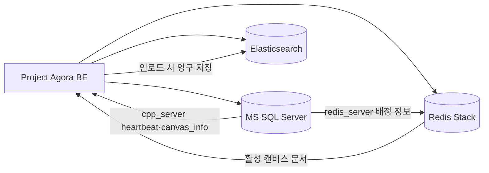

# Project Agora DB

Project Agora의 저장소 인프라입니다. 기본 Docker Compose 구성은 개발용 단일 노드입니다. 클러스터 배포 템플릿은 MS SQL Server Availability Group과 Redis Sentinel HA 구성으로 별도 제공합니다. 애플리케이션 계정, 스키마, RedisJSON/RediSearch, Elasticsearch 인덱스를 초기화합니다.

애플리케이션 및 실시간 서버는 [Project Agora BE](../project-agora-BE)에서 실행합니다.

## 구성

| 저장소 | 역할 | 컨테이너 | 기본 로컬 포트 |
| --- | --- | --- | --- |
| MS SQL Server 2022 | 사용자, 세션, 캔버스 배정, C++·Redis 서버 메타데이터 | `agora-mssql` | `1433` |
| Redis Stack | 활성 캔버스 RedisJSON, RediSearch | `agora-redis-stack` | `6379` |
| Redis Insight | Redis 관리 UI | `agora-redis-stack` | `8001` |
| Elasticsearch 8.15 | 캔버스 문서 영구 저장과 검색 | `agora-elasticsearch` | `9200` |

기본 단일 노드 구성의 세 서비스는 Compose 네트워크 `agora-net`을 공유합니다. 기본값은 호스트의 loopback에만 DB, Redis, Elasticsearch를 바인딩합니다. HA 구성은 별도 Compose 네트워크와 노드 구성을 사용합니다.



## 빠른 시작

### 1. 환경 파일 준비

각 서비스는 독립 환경 파일을 사용합니다. 예시 파일을 복사한 뒤 모든 `change-me` 값을 충분히 긴 난수로 교체합니다.

```bash
cd /path/to/project-agora-DB
cp mssql/.env.example mssql/.env
cp redis/.env.example redis/.env
cp elasticsearch/.env.example elasticsearch/.env
chmod 600 mssql/.env redis/.env elasticsearch/.env
```

| 파일 | 필수 비밀값 |
| --- | --- |
| `mssql/.env` | `MSSQL_SA_PASSWORD`, `MSSQL_PASSWORD` |
| `redis/.env` | `REDIS_PASSWORD`, `REDIS_USER_PASSWORD` |
| `elasticsearch/.env` | `ELASTIC_PASSWORD`, `ES_USER_PASSWORD` |

비밀번호는 Git에 추가하지 않습니다. BE의 `DB_PASSWORD`, `REDIS_USER_PASSWORD`, `ES_USER_PASSWORD`는 이 저장소의 애플리케이션 사용자 비밀번호와 일치해야 합니다.

### 2. 컨테이너 실행

```bash
docker compose up -d
docker compose ps
```

`mssql-init`은 MS SQL health check 이후 스키마를 적용하는 일회성 컨테이너입니다. 상태와 로그를 확인합니다.

```bash
docker compose logs mssql-init
docker compose ps
```

### 3. 초기화 재실행 또는 개별 초기화

초기화 스크립트는 반복 실행할 수 있도록 작성되었습니다. 마이그레이션을 다시 적용하거나 컨테이너 밖에서 초기화할 때 사용합니다.

```bash
./mssql/init-mssql.sh
./redis/init-redis.sh
./elasticsearch/init-elasticsearch.sh
```

초기화 후 BE 실행 방법은 [Project Agora BE README](../project-agora-BE/README.md)를 참고하세요.

## 클러스터 구성

현재 SQL Server 스키마와 Redis 키/JSON 형식은 유지합니다. 클러스터 구성은 기본 단일 노드 Compose와 별도 실행합니다.

### MS SQL Server

[SQL Server AG 배포 안내](mssql/cluster/README.md)의 노드 Compose를 각 Linux 호스트에서 실행합니다. 이 저장소의 단일 DB에 맞춰 Standard Basic Availability Group 데이터 복제본 2개와 Express 설정 전용 복제본 1개를 사용합니다. 운영 HA에는 호스트 Pacemaker와 fencing 구성이 필요합니다. AG listener를 기존 `DB_HOST` 및 관리 스크립트의 접속 주소로 사용합니다.

### Redis Stack HA

기존 `FT.SEARCH`/RedisJSON 기능을 유지하기 위해 OSS Redis Cluster 샤딩 대신 Sentinel 기반 primary/replica failover를 제공합니다. Redis OSS Cluster API는 현재 RediSearch 검색 기능과 호환되지 않습니다. Sentinel은 데이터를 샤딩하지 않으며, 기존 Redis 명령과 단일 키 구조를 유지합니다.

기존 단일 Redis 데이터는 새 Compose 볼륨에 자동 복사되지 않으므로, [Redis HA 마이그레이션 안내](redis/cluster/README.md)에 따라 snapshot을 옮긴 뒤 전환합니다. 개발/검증용으로 한 호스트에 노드가 함께 올라오므로, 이 구성만으로 호스트 장애까지 보호하지는 않습니다.

실제 호스트 장애 대응은 [Redis 다중 호스트 배포 절차](redis/cluster/README.md)의 `docker-compose.ha-node.yml`을 각 Redis 호스트에서 실행합니다. `docker-compose.sentinel.yml`은 단일 호스트 failover 검증용입니다.

```bash
./redis/snapshot-standalone.sh
docker compose stop redis-stack
docker compose --env-file redis/.env -f redis/docker-compose.sentinel.yml create redis-primary
docker cp /tmp/agora-redis-dump.rdb agora-redis-primary:/data/dump.rdb
docker compose --env-file redis/.env -f redis/docker-compose.sentinel.yml up -d
./redis/init-redis-sentinel.sh
```

이 구성은 Redis 노드 3개와 Sentinel 3개를 사용합니다. 현재 애플리케이션 endpoint 등록은 초기 primary를 가리킵니다. 장애조치 후 새 primary를 자동으로 찾는 기능은 BE/C++가 Sentinel을 조회하거나 별도 안정 endpoint를 사용하도록 연결 계층에서 추가해야 합니다. Sentinel 포트(26379–26381)는 신뢰할 수 있는 사설망에서만 열어야 합니다. 운영에서 호스트 장애도 견디려면 Redis 노드와 Sentinel을 서로 다른 호스트에 분산하고, 각 노드가 서로 및 클라이언트에서 접근 가능한 주소를 광고하도록 배포해야 합니다. Redis 저장소 조회·정리 도구는 HA 노드 중 현재 primary를 찾아 실행합니다.

백엔드가 처리할 구체적인 연결 및 장애조치 요구 사항은 [백엔드 클러스터 전환 요구 사항](#백엔드-클러스터-전환-요구-사항)을 참고하세요.

## 환경 변수

### MS SQL Server — `mssql/.env`

| 변수 | 설명 |
| --- | --- |
| `MSSQL_SA_PASSWORD` | SQL Server 관리자 비밀번호 |
| `MSSQL_PID` | 라이선스 에디션. 기본 `Express` |
| `TIMEZONE` | 컨테이너 시간대 |
| `MSSQL_DB` | 데이터베이스 이름, 기본 `agora_db` |
| `MSSQL_USER`, `MSSQL_PASSWORD` | BE·C++가 사용하는 애플리케이션 계정 |
| `MSSQL_PORT`, `MSSQL_EXTERNAL_IP`, `MSSQL_EXTERNAL_PORT` | 내부 포트와 호스트 포트 바인딩 |
| `MSSQL_TABLE_USERS`, `MSSQL_TABLE_REDIS_SERVER` | 사용자·Redis 서버 테이블 이름 |
| `MSSQL_TABLE_CANVAS_INFO`, `MSSQL_TABLE_CPP_SERVER` | 캔버스·C++ 서버 테이블 이름 |

### Redis Stack — `redis/.env`

| 변수 | 설명 |
| --- | --- |
| `REDIS_PASSWORD` | Redis 기본 사용자 비밀번호 및 health check 용도 |
| `REDIS_USER`, `REDIS_USER_PASSWORD` | `canvas:*` 범위로 제한된 애플리케이션 ACL 계정 |
| `TIMEZONE` | 컨테이너 시간대 |
| `REDIS_INDEX_NAME` | 기본 `idx:canvas` |
| `REDIS_KEY_PREFIX` | 기본 `canvas:` |
| `REDIS_PORT`, `REDIS_BIND_IP`, `REDIS_EXTERNAL_IP`, `REDIS_EXTERNAL_PORT` | Redis 포트와 호스트 바인딩·등록 주소 |
| `REDIS_INSIGHT_PORT` | Redis Insight 포트 |

### Elasticsearch — `elasticsearch/.env`

| 변수 | 설명 |
| --- | --- |
| `ELASTIC_PASSWORD` | `elastic` 관리자 비밀번호 |
| `TIMEZONE` | 컨테이너 시간대 |
| `ES_INDEX` | 캔버스 인덱스, 기본 `canvas` |
| `ES_USER_NAME`, `ES_USER_PASSWORD` | BE·C++가 사용하는 애플리케이션 사용자 |
| `ES_EXTERNAL_IP`, `ES_EXTERNAL_PORT` | 호스트 포트 바인딩 |
| `ES_JAVA_MIN_MEM`, `ES_JAVA_MAX_MEM` | Elasticsearch JVM 메모리 |

## 데이터 모델과 수명 주기

MS SQL은 관계형 메타데이터와 현재 배정 상태를 보관합니다.

| 테이블 | 용도 |
| --- | --- |
| `users` | 이메일, BCrypt 비밀번호 해시, 닉네임·태그, 역할, 상태 |
| `user_sessions` | 사용자별 현재 접속 여부, 캔버스, C++ 서버 참조 |
| `redis_server` | 사용 가능한 Redis 인스턴스 |
| `cpp_server` | C++ REST/WS 포트, 활성 여부, `last_heartbeat_at` |
| `canvas_info` | Redis·C++ 서버 배정 및 `is_cached` 상태 |

캔버스 본문은 Elasticsearch에 영구 저장하고, 접속 중에는 RedisJSON의 `canvas:{canvasId}` 키에 둡니다. C++ 서버가 마지막 접속자를 확인하면 RedisJSON 문서를 Elasticsearch로 저장하고 Redis 키 및 `canvas_info` 배정을 해제합니다.

`cpp_server`의 식별자는 `(server_ip, server_port)`입니다. C++ 서버가 5초마다 heartbeat를 갱신하며 BE는 최신 heartbeat와 health check를 모두 만족한 서버만 할당합니다.

## 운영 명령

```bash
# 전체 상태와 로그
docker compose ps
docker compose logs -f mssql redis-stack elasticsearch

# 컨테이너 중지·재시작 — 데이터 볼륨 유지
docker compose stop
docker compose start

# Compose 설정 검증
docker compose config -q
```

데이터 볼륨을 포함한 완전 초기화는 되돌릴 수 없습니다. 일반적인 개발 데이터 정리는 아래 스크립트를 먼저 사용하세요.

```bash
# 확인 후 전체 테스트 데이터 정리
./clean-storages.sh

# 확인 없이 실행 — 현재 데이터에 영향을 주므로 주의
./clean-storages.sh -y

# 저장소별 정리
./mssql/clean-mssql.sh -y
./redis/clean-redis.sh -y
./elasticsearch/clean-elasticsearch.sh -y
```

## 점검과 검색

```bash
# 세 저장소의 애플리케이션 계정, CRUD, 권한 검증
python3 tests/test_storages.py

# 전체 저장소 조회 또는 키워드 검색
./search-storages.sh
./search-storages.sh -q "keyword"

# 저장소별 조회
./mssql/search-mssql.sh
./redis/search-redis.sh
./elasticsearch/search-elasticsearch.sh
```

`tests/test_storages.py`는 임시 사용자, 캔버스, 문서를 만들고 테스트 종료 시 삭제합니다. 운영 데이터가 있는 환경에서는 테스트 전 백업과 실행 대상 확인이 필요합니다.

## BE 연결 설정

BE 루트 `.env`에는 이 저장소의 애플리케이션 계정 정보를 전달합니다.

```dotenv
DB_HOST=127.0.0.1
DB_PORT=1433
DB_NAME=agora_db
DB_USER=<MSSQL_USER>
DB_PASSWORD=<MSSQL_PASSWORD>

REDIS_USER=<REDIS_USER>
REDIS_USER_PASSWORD=<REDIS_USER_PASSWORD>

ES_HOST=127.0.0.1
ES_PORT=9200
ES_INDEX=<ES_INDEX>
ES_USER_NAME=<ES_USER_NAME>
ES_USER_PASSWORD=<ES_USER_PASSWORD>
```

현재 BE와 C++은 DB 등록 정보로 Redis 위치를 찾습니다. 단일 노드에서는 Redis 컨테이너를 시작한 뒤 `./redis/init-redis.sh`를 실행해 Redis 사용자, 색인, `redis_server` 등록을 완료해야 합니다. 클러스터 전환 시 변경할 연결 동작은 아래 요구 사항을 따릅니다.

## 백엔드 클러스터 전환 요구 사항

대상은 BE와 C++ 실시간 서버의 저장소 연결 계층입니다. SQL 스키마, `canvas:{canvasId}` 키, RedisJSON 문서, RediSearch 색인, Elasticsearch 저장 흐름은 유지하고, DB/Redis 노드 주소를 직접 고정하는 부분과 장애 후 재연결 동작을 바꿉니다.

### SQL Server Availability Group

- `DB_HOST`에는 개별 SQL Server 호스트가 아니라 AG listener의 DNS 이름 또는 가상 IP를 설정하고, `DB_PORT`에는 listener 포트를 설정합니다. 현재 `DB_NAME`, 사용자, 비밀번호와 쿼리·스키마는 그대로 사용합니다.
- 연결 풀은 장애조치 때 끊긴 TCP 세션을 폐기하고 listener로 새 연결을 만들어야 합니다. 연결 실패는 제한된 횟수와 backoff로 재시도합니다. AG listener와 클라이언트의 재연결 동작은 [SQL Server Linux AG 문서](https://learn.microsoft.com/en-us/sql/linux/sql-server-linux-availability-group-overview?view=sql-server-ver17)를 따릅니다.
- 쓰기 요청은 listener를 통해 현재 primary로 보내야 합니다. 재시도할 때는 기존 트랜잭션을 폐기한 뒤 작업 전체를 다시 시작하고, 커밋 여부가 불분명하거나 중복 수행에 안전하지 않은 작업은 무조건 재실행하지 않습니다.

### Redis Sentinel

- BE와 C++은 Redis Sentinel을 지원하는 클라이언트를 사용합니다. Redis Cluster 슬롯 검색 모드가 아니라 Sentinel discovery를 사용합니다. Sentinel 클라이언트는 Sentinel seed에 질의해 현재 primary 주소를 조회해야 합니다([Redis Sentinel client 문서](https://redis.io/docs/latest/develop/reference/sentinel-clients/)).
- 설정에는 접근 가능한 Sentinel 주소 전체(운영 구성 기준 3개, 포트 `26379`)와 master 이름 `agora-master`, Redis ACL 계정 및 비밀번호가 필요합니다. 예시 변수명은 아래와 같으며 실제 이름은 애플리케이션 설정 규칙에 맞춥니다.

  ```dotenv
  REDIS_SENTINELS=10.0.0.21:26379,10.0.0.22:26379,10.0.0.23:26379
  REDIS_SENTINEL_MASTER_NAME=agora-master
  REDIS_USER=<REDIS_USER>
  REDIS_USER_PASSWORD=<REDIS_USER_PASSWORD>
  ```

- 쓰기 연결은 Sentinel이 알려준 현재 primary를 사용합니다. 연결 끊김이나 replica 승격 후 기존 연결 풀을 비우고 Sentinel에 다시 질의해 새 primary로 연결해야 합니다. 모든 BE/C++ 호스트에서 Sentinel 주소의 `26379`와 각 Redis 노드 주소의 `6379`에 접근할 수 있어야 합니다.
- `redis_server`의 현재 `redis_ip`/`redis_port` 등록값은 초기 primary 한 대의 주소이므로 failover 후 갱신되지 않습니다. 단일 HA 서비스에서는 세 노드를 각각 독립된 할당 대상으로 등록하지 말고, 기존 `redis_id`를 failover에도 유지되는 논리 서비스 식별자로 사용합니다. 이 경우 BE/C++은 행의 `redis_ip`/`redis_port`로 접속하지 않고 Sentinel에서 실제 primary 주소를 받아야 합니다. 여러 Redis 서비스를 동적으로 선택해야 한다면 Sentinel seed와 master 이름을 저장할 수 있도록 등록 모델을 확장합니다.
- 기존 `canvas:{canvasId}` 문서와 RediSearch 사용은 유지합니다. Sentinel failover는 샤딩을 제공하지 않으므로 Redis Cluster 전용 `MOVED`/slot 라우팅 로직을 추가할 필요는 없습니다. replica 읽기는 복제 지연으로 오래된 값을 반환할 수 있으므로 일관성 요구를 검토하지 않고 읽기 대상으로 사용하지 않습니다.

### 장애 후 데이터와 요청 처리

- Redis 복제는 비동기이므로 failover 직전 primary에서 확인된 일부 쓰기가 새 primary에 복제되지 않았을 수 있습니다([Redis replication 문서](https://redis.io/docs/latest/operate/oss_and_stack/management/replication/)). 애플리케이션은 캔버스 문서가 없거나 `canvas_info.is_cached`와 실제 Redis 키 상태가 다른 경우를 처리해야 하며, 기존 Elasticsearch 문서에서 복구할지 또는 사용자에게 재시도를 요청할지 동작을 정해야 합니다.
- 연결 오류에 대한 재시도는 요청 종류에 맞게 제한합니다. 완료 여부가 불명확한 비멱등 쓰기를 그대로 다시 보내 중복 반영하지 않도록 요청 식별자, 중복 방지 또는 상태 확인을 사용합니다.
- 배포 전 장애조치 검증에서 SQL 연결 풀의 복구, Redis primary 재탐색, 캔버스 문서/색인 접근, 진행 중 요청의 중복·유실 처리를 확인합니다. 장애조치 후에도 애플리케이션 설정이나 `canvas_info.redis_id`를 수동 변경하지 않고 서비스를 이어갈 수 있어야 합니다.

## 저장소 구조

```text
mssql/          SQL Server Compose, 스키마, 초기화·검색·정리 스크립트
redis/          Redis Stack Compose, ACL·RedisJSON·RediSearch 초기화 스크립트
elasticsearch/  Elasticsearch Compose, 사용자·인덱스 초기화 스크립트
tests/          저장소 통합 테스트
*.sh            통합 검색 및 정리 도구
```

## 라이선스

이 저장소는 Project Agora의 일부이며 [MIT License](LICENSE)를 따릅니다.
